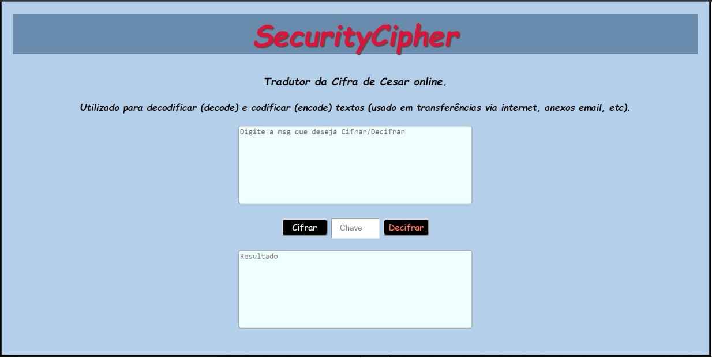

# Cifra de César

## Índice

* [1. Prefácio](#1-prefácio)
* [2. Definição do produto](#2-resumo-do-projeto)

***

## 1. Prefácio

Cifrar significa codificar. A [cifra de
César](https://pt.wikipedia.org/wiki/Cifra_de_C%C3%A9sar) é um dos primeiros
tipos de criptografias conhecidas na história. O imperador romano Júlio César
utilizava essa cifra para enviar ordens secretas aos seus generais no campo de
batalha.

A cifra de César é uma das técnicas mais simples de cifrar uma mensagem. É um
tipo de cifra por substituição, em que cada letra do texto original é
substituida por outra que se encontra há um número fixo de posições
(deslocamento) mais a frente do mesmo alfabeto.

Por exemplo se usarmos o deslocamento (_offset_) de 3 posições:

* Alfabeto sem cifrar: A B C D E F G H I J K L M N O P Q R S T U V W X Y Z
* Alfabeto com cifra:  D E F G H I J K L M N O P Q R S T U V W X Y Z A B C
* A letra A será D
* A palavra CASA será FDVD

Atualmente todas as cifras de substituição alfabética simples, são decifradas
com facilidade e não oferecem muita segurança na comunição, mas a cifra de César
muitas vezes pode fazer parte de um sistema mais complexo de criptografia, como
a cifra de Vigenère, e tem aplicação no sistema ROT13.

## 2. Definição do produto

Com o crescente uso das redes de computadores por organizações para conduzir seus negócios e a massificação do uso da Internet, surgiu a necessidade de se utilizar melhores mecanismos para prover a segurança das transações de informações confidenciais. A questão segurança é bastante enfatizada, principalmente, quando imagina-se a possibilidade de se ter suas informações expostas a atacantes ou intrusos da Internet, que surgem com meios cada vez mais sofisticados para violar a privacidade e a segurança das comunicações. 

Uma das maneiras de se evitar o acesso indevido a informações confidenciais é através da criptografia, fazendo com que apenas as pessoas às quais estas informações são destinadas, consigam compreendê-las. A criptografia fornece técnicas para codificar e decodificar dados, tais que os mesmos possam ser armazenados, transmitidos e recuperados sem sua alteração ou exposição. Em outras palavras, técnicas de criptografia podem ser usadas como um meio efetivo de proteção de informações suscetíveis a ataques, estejam elas armazenadas em um computador ou sendo transmitidas pela rede. Seu principal objetivo é prover uma comunicação segura, garantindo serviços básicos de autenticação, privacidade e integridade dos dados.

